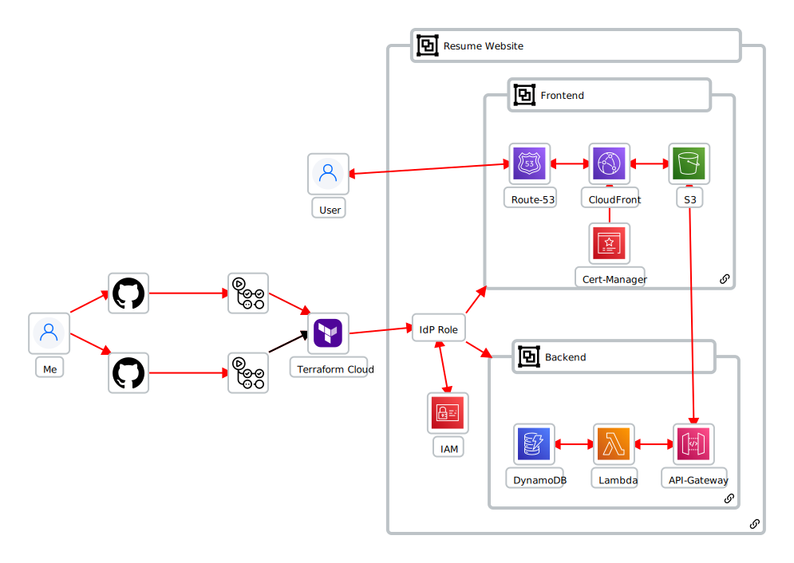
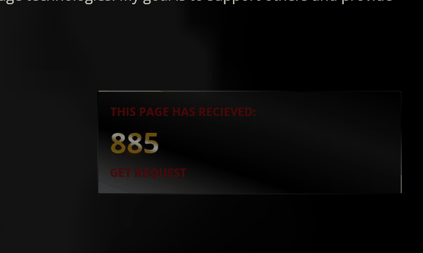

# backend-terraform (Cloud Resume Challenge - Terraform)

Welcome!!!

This is where my first ever Terraform, fully deployable, Resume website is!!!
This is the infrastructure for the frontend of the blog site. This houses my Resume infrastructure.

So whenever I make an edit in my repo here, that translates to my AWS infrastructure. It looks something like this:

## Backend

This repository handles the backend of my infrastructure, linking to my frontend github repository. This is where I built my visitor/GET request counter that updates the number of views to my dynamodb table with an incremental python lambda script. How does it link? With my RESTful API hosted my AWS APIGateway, it handles the Cross-Origin-Resource-Sharing (CORS) and ensures that it is always available for my website domain only, as to harden my lambda function from misuse.

